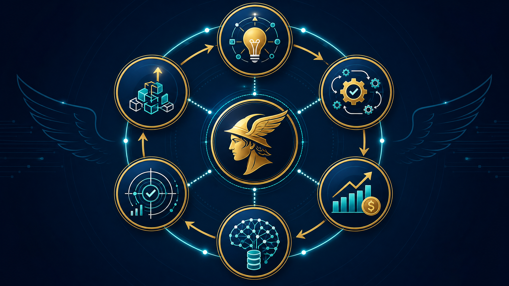
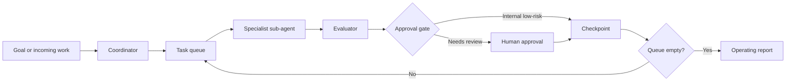
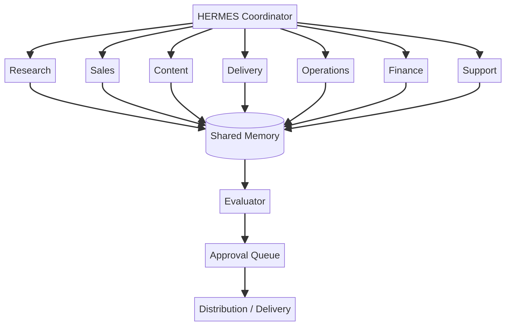

<div align="center">


# HERMES Business Harness

### The operating system for an AI-native business

**Specialist sub-agents. Reusable skills. Approval-gated autonomy. Distribution-ready workflows.**

[](https://www.python.org/)
[](LICENSE)
[](config/)
[](tests/)
[](config/policy.json)
[](prompts/)

</div>

<p align="center">
  
</p>

> **HERMES turns business processes into an accountable agent workforce.** It coordinates specialist sub-agents, loops over work queues, evaluates outputs, and stops at human approval gates before consequential actions.

## Why this exists

Most AI business experiments stop at a prompt. HERMES treats AI as an operating system: each agent has a bounded role, each skill has a definition of done, each workflow emits checkpoints, and each external action has an explicit policy gate.

HERMES is autonomous where autonomy is useful—triage, research, drafting, routing, evaluation, queue management, and reporting. It is deliberately not autonomous where mistakes can create legal, financial, security, privacy, or reputational harm.

## See the system

<p align="center">
  
</p>

### The loop



The rendered version is available at [`docs/rendered/workflow-map.png`](docs/rendered/workflow-map.png), and the editable source is [`docs/workflow-map.mmd`](docs/workflow-map.mmd).

## What is inside

| Layer | Included | Why it matters |
|---|---|---|
| **Coordinator** | Founder Orchestrator skill and task routing | Converts goals into bounded work |
| **Sub-agents** | Research, Sales, Content, Delivery, Operations, Finance, Support | Keeps roles specialized and testable |
| **Skills** | Markdown contracts with inputs, outputs, QA, and escalation | Makes agent behavior reusable |
| **Workflows** | Weekly review, content distribution, lead-to-outreach, client delivery | Makes loops explicit and auditable |
| **Policy** | Risk matrix and approval requirements | Prevents unsafe external execution |
| **Distribution** | Channel queue for email, LinkedIn, X, website, newsletter | Separates drafting from publishing |
| **CLI** | `status`, `validate`, `skills`, `workflows`, `run` | Lets you inspect and operate the harness locally |
| **Tests** | Configuration, checkpoints, and missing-input tests | Keeps the system dependable as it grows |

## Agent topology

<p align="center">
  
</p>

The coordinator does not replace the specialists. It routes work to the smallest capable agent, collects outputs into shared memory, sends them through evaluation, and places consequential actions into an approval queue.

## Quick start

```bash
python -m venv .venv
source .venv/bin/activate
pip install -e .

hermes status
hermes validate
hermes skills
hermes workflows
hermes run weekly-review --input examples/weekly-review.json
```

Example output is an auditable workflow object with stages, checkpoints, approval state, payload, and next action. The current distribution configuration is intentionally **dry-run** with all channels disabled.

## Repository map

```text
config/                         Agents, policy, distribution, metrics
skills/                         Specialist-agent contracts
prompts/                        Provider-neutral prompt pack
workflows/                      Workflow definitions and stages
src/hermes_harness/             CLI and workflow engine
examples/                       Sample payloads
tests/                          Offline tests
docs/workflow-map.mmd           Editable workflow diagram
docs/agent-topology.mmd         Editable agent topology diagram
docs/rendered/                  PNG exports for README and docs
assets/                         Logo, banner, and framework visual
```

## The safety model

HERMES can prepare an email, but it cannot send it without approval. It can prepare a finance report, but it cannot transfer money. It can draft content, but it cannot publish it by default. It can identify a security concern, but it must escalate rather than improvise.

| Action | Agent can prepare | Automatic execution | Approval |
|---|---:|---:|---:|
| Internal research brief | Yes | Yes, if low risk | Not always |
| Content draft | Yes | No | Required before publishing |
| Outreach draft | Yes | No | Required before sending |
| Client deliverable | Yes | No | Required before delivery |
| Refund or payment | Prepare data only | No | Always |
| Official filing | Prepare data only | No | Always |
| Permission change or deletion | No | No | Always |

## Distribution architecture

The distribution layer is designed as a queue, not a blind autoposter. Every item records its channel, source references, objective, risk flags, version, approval state, and outcome. The default state is `needs_review`; channel adapters can be added later without changing the business logic.

```text
source material -> content agent -> quality checks -> approval queue
                                                    |
                 +----------------------------------+------------------+
                 |                  |                |                 |
               email            LinkedIn             X             website/newsletter
```

## Build your first autonomous loop

1. Choose a frequent, measurable, low-to-moderate-risk business process.
2. Define one agent with one job and one output contract.
3. Add a skill with examples, quality checks, and escalation rules.
4. Run the workflow in dry-run mode against real historical work.
5. Review checkpoints and measure time, quality, cost, and rework.
6. Add a real tool adapter only after the workflow is reliable.

## Roadmap

- Provider adapters behind the existing workflow contracts.
- Persistent run ledger with replayable checkpoints.
- Evaluation datasets and regression scoring.
- Approval dashboard for the distribution queue.
- Vertical packs for agencies, consultants, ecommerce, and professional services.
- Optional scheduled runner with explicit credentials and per-channel policies.

## Contributing

Open an issue with the business workflow, skill contract, or adapter you want to improve. New skills should include a clear mission, inputs, output contract, definition of done, quality checks, and escalation rules. New external integrations must default to dry-run and document their approval behavior.

## License and safety

Apache-2.0. This project is an operating framework, not legal, financial, medical, tax, or security advice. Review outputs before using them in consequential decisions.

<div align="center">

**Build the system. Keep the judgment. Scale what works.**

</div>
